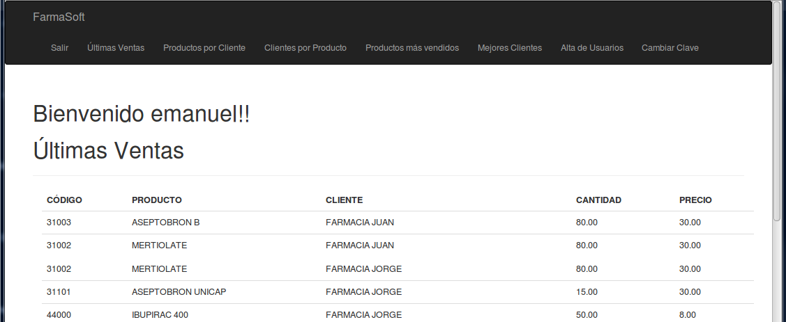
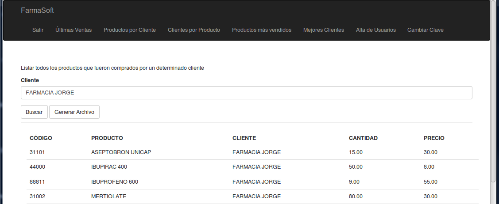
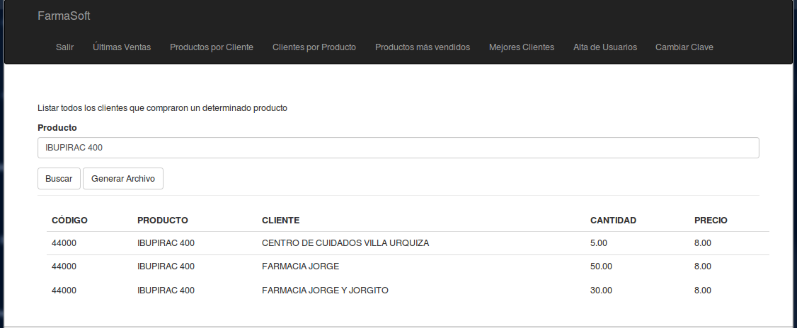

# Aplicación para Farmacias (Examen 1 de Estructura de Datos)

### Integrantes: Mariana Duran, Emanuel Machado

## Flujo del programa

Se accederá al programa por medio un login. En caso de no estar registrado, el usuario tendrá una pantalla de registración.

Una vez que el usuario ingresó en el sistema, podrá realizar las siguiente consultas:

**Ultima Ventas**: Se mostrarán las últimas diez ventas de la farmacia.

**Productos por cliente**: Se mostrarán las ventas que se realizaron a un determinado cliente.

**Clientes por producto**: Se mostrarán las ventas de un determinado producto. Se podrá ver qué clientes lo compraron.

**Productos más vendidos**: Se mostrarán los cinco productos más vendidos. Si hay varios en el quinto puesto también los mostrará.

**Mejores Clientes**: Se mostrará los cincos clientes más compradores. Si hay varios en el quinto puesto también los mostrará.

## Modo de uso

1) El usuario accede a la página y le aparece una pantalla de presentación.

2) Al hacer clic en el link "Registrarse el usuario verá la pantalla de registración

3) Una vez que el usuario ingresa le aparece una pantalla de bienvenida con las últimas ventas

4) Si en la barra de menús el usuario hace clic en el link "Últimas Ventas" le mostrará también las últimas ventas

5) Al hacer clic en el link "Productos por Cliente" le aparecerá una pantalla donde podrá consultar las ventas que se le hicieron a un cliente.

6) Al hacer clic en el link "Clientes por Producto" le aparecerá una pantalla donde se podrá consultar las ventas de un producto especificado por el usuario

7) Al hacer clic en el link "Productos más Vendidos" se mostrará una pantalla con los cinco productos más vendidos. Hay que tener en cuenta que si hay varios productos en el quinto también los muestra.

8) Al hacer clic en el link "Mejores Clientes" se mostrará una pantalla con los cinco clientes más compradores. Hay que tener en cuenta que si hay varios clientes en el quinto también los muestra.

## Estructura del programa

La idea de nosotros es organizar el código de forma que el controlador sólo se ocupe de llamar a las páginas web. Que haya un archivo .py que se encargue de realizar la lógica del programa, y un archivo .py también que se encargue de traer los datos de los csv. 
De esta forma si el día de mañana queremos que la información del sistema en lugar de tomarse desde un .csv se tome desde una base de datos como mysql, con modificar el archivo datos.py para que se conecte al mysql no haría falta modificar el resto de la aplicación.

El esquema gráficamente sería algo así:

### carpeta principal
En la carpeta principal del sistema estará ubicado el controlador que es el encargado de llamar a los html.

**app.py**: En este archivo se encuentran las funciones que se encargan de llamar a los distintos templates. Además llama a las funciones que se encuentran en el archivo logica.py que son las encargadas de traer la información.

**forms.py**: Son clases con las que se arman las templates

**usuarios.csv**: Archivo donde están los usuarios del sistema

**ventas.csv**: Archivo donde se encuentran las ventas de productos

### carpeta templates

En esta carpeta se encuentran los .html, que son los que se muestran en el browser del usuario.

**404.html**: En caso de que haya un error 404
 
**404_ingresado.html**: En caso de que haya un error 404

**500.html**: En caso de que haya un error 500
 
**500_ingresado.html**: En caso de que haya un error 500

**base.html**: Se encuentra la barra de menús de ingreso, solo con los links de "Ingresar" y "Registrar"

**base_consultas.html**: Se encuentra la barra de menús pero de cuando un usuario ya está ingresado.

**clientes_mas_compradores.html**: Muestra los clientes más compradores

**clientes_por_producto.html**: Muestra los clientes por producto

**index.html**: Página principal

**ingresado.html**: Página de bienvenida con últimas ventas que se muestra cuando el usuario ingresa en el sistema.

**logged_out.html**: Página de despedida cuando el usuario se desloguea.

**login.html**: Página de login.

**productos_mas_vendidos.html**: Pantalla con los productos más vendidos.

**productos_por_cliente.html**: Pantalla donde se puede filtrar las ventas por cliente.

**registrar.html**: Pantalla de registración

**ultimasVentas.html**: Pantalla de últimas ventas

### carpeta logica

En esta carpeta se encuentra que se encarga de procesar la información que viene de datos.py

**logica.py**: Se encarga de llamar a las funciones de datos.py que lo que hacen es traerse los datos de los .csv. Luego de esto los procesa dependiendo de lo que pide el usuario.

Las funciones que se usan son las siguiente:

*traerClientes*: Devuelve una lista de clientes ordenada por nombre (se utiliza para el combo de clientes).

*traerProductos*: Devuelve una lista de productos ordenada por el nombre del producto.

*traerUltimasVentas*: Devuelve una lista con las últimas 10 ventas

*traerProductosPorCliente*: Devuelve una lista con las ventas que se le hicieron a un determinado cliente.

*traerClientesPorProduco*: Devuelve una lista con las ventas de un determinado producto.

*traerProductosMasVendidos*: Devuelve una lista con los 5 productos más vendidos. Si el quinto puesto está compartido por varios productos también los trae.

*traerClientesMasCompradores*: Devuelve una lista con los 5 clientes más compradores. Si el quinto puesto está compartido por varios clientes también los trae.

*validarExisteUsuario*: Llama a la función de datos.py que valida el usuario.

*grabarUsuario*: Llama a la función de datos.py que graba el usuario.

*buscarUsuario*: Llama a la función de datos.py que busca un determinado usuario.

**datos.py**: Se encarga de leer y validar los archivos .csv

Las funciones que se usan son las siguiente:

*leerRegistro*: Luego de que se lee un registro del archivo ventas.csv, valida si tiene los datos correctos, y lo devuelve.

*definirArchivo*: Observa cuál es el orden de la cabecera de ventas.csv

*traerVentas*: Devuelve una lista con todos los registros de ventas.csv.

*validarExisteUsuariosDatos*: Función que valida si existe un usuario determinado.

*grabarUsuarioDatos*: Se graba el usuario en usuarios.csv.

*buscarUsuarioDatos*: busca usuario y contraseña en usuarios.csv-

## Clases que se utilizaron

En forms.py se utilizaron las clases:

*LoginForm*: Se definen los textbox y el botón de aceptar de la pantalla de login. 

*RegistrarForm*: Se definen los textbox y el botón de aceptar de la pantalla de registración.

*ProductosPorClienteForm*: Se define el textbox y el botón de aceptar para la pantalla de consulta de productos por cliente.

*ClientesPorProductoForm*: Se define el textbox y el botón de aceptar para la pantalla de consulta de clientes por producto.

Estas cuatro clases se usaron para tener más ordenado los forms que se van a utilizar. Nos parece mejor hacerlo así que por html. El día de mañana si queremos agregar un textbox, directamente lo hacemos desde esta pantalla, simplificando las modificaciones en el html, ya que nosotros no somos diseñadores.

En la carpeta entidades tenemos tenemos tres archivos donde están las clases que vamos a usar en el sistema. Estas son:

*cliente*: Entidad de clientes.

*producto*: Entidad de productos.

*venta*: Entidad de ventas.

Cada vez que leemos un registro de ventas.csv generamos una instancia de la clase ventas. Esto nos facilita la representación de una venta en el sistema.
Lo mismo sucede con un cliente o un producto. Estas dos últimas clases las usamos para llenar los combos de filtros.

